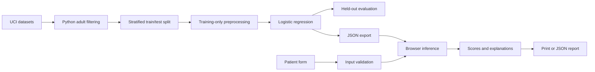

# AI-Based Early Disease Prediction System Using Patient Health Data

**Application:** Vitalis — Health Intelligence
**Domain:** Artificial intelligence, healthcare, web engineering

## 1. Abstract

This project combines symptoms, medical history, vital signs, and laboratory measurements in a responsive website. Two supervised models classify patterns associated with heart disease and chronic kidney disease. Models are trained offline using public UCI datasets and exported to JSON. Browser-based inference keeps entered health values off an application server. Results include feature explanations and downloadable reports.

“Early disease prediction” describes the research motivation. The datasets label existing disease, so the implemented prototype does not prove early-detection utility or predict future onset.

## 2. Objectives and scope

Objectives are to collect heterogeneous health inputs, train reproducible classifiers, validate data, explain outputs, and present measured results. The project supports adults and two conditions. It does not provide medication advice, clinical diagnosis, persistent medical records, or a native mobile app. The responsive website works in a mobile browser.

## 3. Requirements

| ID | Function | Implementation |
| --- | --- | --- |
| F1 | Profile/history | Age, historical sex category, hypertension, diabetes, coronary disease, anemia |
| F2 | Symptoms | Chest pain classification, exercise angina, appetite, pedal edema |
| F3 | Vitals | Resting systolic pressure, maximum exercise-test heart rate |
| F4 | Labs | Cholesterol, random glucose, blood urea, creatinine, hemoglobin |
| F5 | ML output | Independent heart and kidney classifiers |
| F6 | Explanations | Additive log-odds feature contributions |
| F7 | Reports | Print / PDF and JSON export |
| F8 | Evaluation | Accuracy, recall, F1, AUC, confusion matrices |
| F9 | Validation | Ranges, types, categories, completeness, training-range warnings |

Nonfunctional requirements include responsive layout, keyboard access, explicit field labels, no assessment upload/storage, reproducible artifacts, and minimal installation.

## 4. Architecture



No inference API or database is needed. Deployment serves only the `public/` directory. Training data and development files are excluded from website artifacts.

## 5. Data and feature selection

**Heart:** UCI dataset 45 contains 303 Cleveland records. The binary target is `num > 0`. Selected inputs are age, sex, chest pain, systolic pressure, cholesterol, maximum heart rate, and exercise angina. Omitting specialized ECG and imaging fields reduces data-entry requirements; reported metrics concern this selected-feature model.

**Kidney:** UCI dataset 336 contains 400 records; 372 have known adult age. The target is `ckd`. Selected inputs are age, random glucose, urea, creatinine, hemoglobin, hypertension, diabetes, coronary disease, appetite, pedal edema, and anemia. The original generic `bp` field is not assumed to be systolic pressure and is not reused as heart `trestbps`.

Mappings: sex female=0/male=1 as provided by the historical dataset; chest pain codes 1–4; yes=1/no=0; poor appetite=1/good=0. “Asymptomatic” is a dataset category, not a disease-free conclusion. Source checksums are retained in model metadata. Full credits and CC BY 4.0 links are in the README.

## 6. Training methodology

1. Download CSVs from UCI; normalize missing tokens and whitespace.
2. Remove children and records with unknown age.
3. Use an 80/20 stratified split, random seed 42, separately for each condition.
4. Fit numeric medians, means, and population standard deviations on training records.
5. Fit categorical modes on training records and one-hot encode supported categories.
6. Fit L2 logistic regression with C=1 and a 2,000-iteration limit.
7. Evaluate the held-out set once; classification metrics use threshold 0.5.
8. Export the evaluated model without refitting it on test records.

```text
z = intercept + sum(weight[j] * transformed_input[j])
score = 1 / (1 + exp(-z))
```

Numeric contributions are relative to standardized training means. Categorical contributions use the fitted intercept and one-hot coefficients. Directions describe additive log-odds terms; they are not causal effects, clinical importance, or SHAP values.

Imputation handles training missingness and reference parity checks. The interface requires complete inputs for each displayed model score. A complete kidney profile can be evaluated independently when heart-specific inputs are missing.

## 7. Measured results

| Measure | Heart | Kidney |
| --- | ---: | ---: |
| Train / test | 242 / 61 | 297 / 75 |
| Accuracy | 0.8525 | 0.9467 |
| Positive recall | 0.8214 | 0.9130 |
| F1 | 0.8364 | 0.9545 |
| ROC AUC | 0.9177 | 0.9760 |
| True negative | 29 | 29 |
| False positive | 4 | 0 |
| False negative | 5 | 4 |
| True positive | 23 | 42 |

These are small-sample, single-split results, not evidence of clinical effectiveness. Both classifiers miss some disease-positive records. No test-set tuning, external validation, prospective study, calibration, or subgroup analysis is claimed.

## 8. Testing

Run `npm test`. Checks cover 24 browser predictions against scikit-learn outputs within 1e-12, invalid input rejection, complete-input requirements, model independence, additive contribution reconstruction, training-range warnings, and metric consistency. Run `node --check public/app.js` for syntax validation.

Manual browser checks should cover the fictional sample, all four steps, invalid inputs, editing and result invalidation, report export, reset, model/project pages, and mobile layout. These are software checks, not clinical validation.

## 9. Demonstration and viva preparation

1. Start the local server following the README.
2. Show the four input categories and select **Try sample patient**.
3. Explain that the data is fictional; review symptoms and measurement units.
4. Generate results and explain why outputs are independent scores.
5. Show contributing factors and distinguish association from causation.
6. Export JSON or print the report.
7. Open **Model insights** and explain the confusion matrices and false negatives.
8. Remove a required field and demonstrate withholding the affected score.
9. Discuss limitations and future work.

**Why logistic regression?** It is an interpretable baseline with compact, verifiable browser inference. A complex model should be justified by a sound validation study.

**Why no backend?** Inference needs only arithmetic and no patient storage is requested. Static hosting is simpler and avoids uploading health inputs.

**What makes this AI?** Coefficients are learned from labeled data; results are not mock values or handwritten symptom weights.

**Does it diagnose early disease?** No. It classifies historical disease labels. Prospective, clinician-led validation is required to demonstrate early detection.

## 10. Privacy, limitations, and future work

Inputs exist in browser memory until reset/reload. The app has no analytics or patient database. Exports contain health data and require private handling. Hosting and Google Fonts receive ordinary requests, without assessment values.

Historical cohorts introduce sampling bias and limited demographic coverage; heart sex coding is binary. Kidney lab values may reflect established disease. Scores are uncalibrated and must not be combined as a disease ranking. Urgent symptoms require medical care independent of results.

Future work should prioritize external validation, calibration, subgroup fairness analysis, clinician review, and prospective outcomes. Additional conditions need appropriate datasets and separate validation. Persistent records would require authentication, consent, security and retention design, and institutional review.
